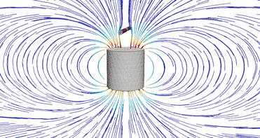

# Testing magnetic field for different geometries

Case for testing the magnetic field distribution for a permanent magnet orbited by a piece of metal. 
This is not a dynamic case, each frame is composed of results from steady state simulations for each particular geometry.

# Requisites

- ElmerFEM 9.0
- Dakota >6.14 
- Salome 9.11 (might work with other versions as well)
- Python 3.10 (not tested with other versions)

# Materials

- Magnet: N42 grade FeNbB permanent magnet. 
- Rod: Linear material with constant permeability (change material properties if you want to use a more realistic BH curve)

# How to run

- Make sure that ElmerFEM, Dakota and Salome are in your path
- run **dakota -in study.in**
- *.vtu files will be in results folder
- Use Paraview to read files and create animation
